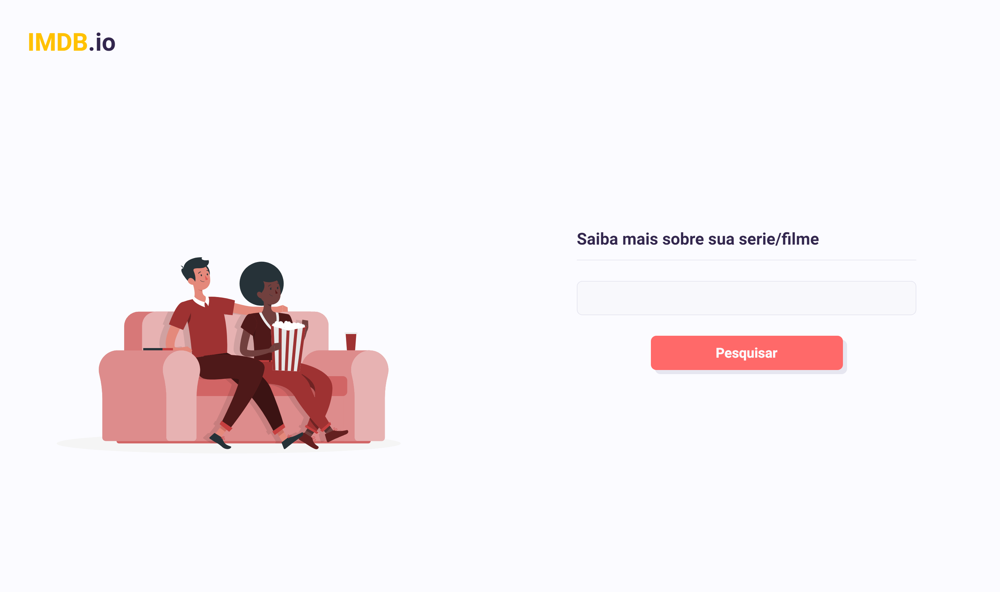

<p align="center">

  

</p>

<h1 align="center">
  IMDB.io
</h1>

<div align="center">

  <a href="https://www.linkedin.com/in/alexsandrogomes/">
    
  </a>

  
</div>

<br>

IMDB.io is a landing page to facilitate adoption searching for movies and series in an easy and dynamic way.

<br>

## Building

You'll need [Node.js](https://nodejs.org) installed on your computer in order to build this app.

Visit the [omdbapi] website (http://www.omdbapi.com/) and if you register, an email will be sent with your credentials, copy and follow the tutorial below.

```bash
# Repository
git clone https://github.com/Alexsandrogms/imdb.io.git

# Directory
$ cd imdb/

# Install Dependencies
$ yarn install # npm install

# Using your credentials
$ cd imdb/src/service

> abra o arquivo "api.js", edite a linha 6 é adicione sua credenciais entre as aspas.

# Run Aplication
$ yarn start # npm start

```

## Author

😎 Alexsandro Gomes Paiva

- Github: [@alexsandrogms](https://github.com/Alexsandrogms)
- Linkedin: [@alexsandrogms](https://linkedin.com/in/alexsandrogomes)

## Contribuindo

Contributions, problems and requests for new features are welcome!
Did you like the project? Take a ⭐️!

This project is under the MIT license. Read morea 📗 [LICENÇA](https://github.com/Alexsandrogms/imdb.io/blob/master/LICENSE) for details.<br>
